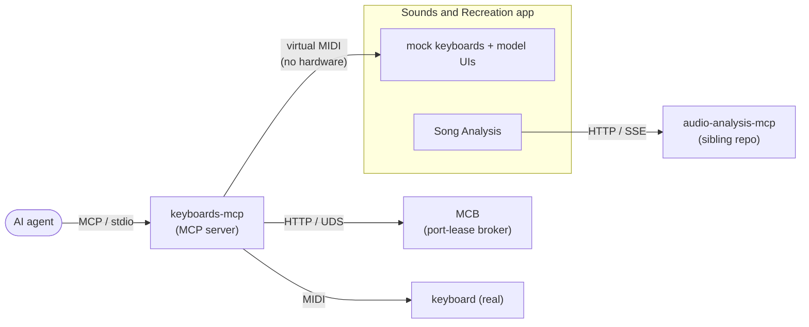

# keyboards-mcp

[](./LICENSE)
[](https://github.com/uribrecher/keyboards-mcp/stargazers)

AI-controlled MIDI keyboards. An MCP server lets an AI agent research a sound and dial it in on real hardware synthesizers over USB MIDI; a companion desktop app simulates those keyboards so you can develop without hardware.

Supported keyboards: **Nord Electro 5D**, **Roland JUNO-X**, **Prophet-6**.

## Packages

This is an **npm-workspaces monorepo** with two packages — each has its own README with quick start, usage, and architecture:

| Package | What it is |
|---------|------------|
| **[`keyboards-mcp`](packages/keyboards-mcp/README.md)** | The published MCP server + shared keyboard-model logic. Point any MCP-compatible agent at it to read/change parameters, load programs and songs, and browse backups over USB MIDI. Published to npm; stays on the `2.0.x` line. |
| **[`sounds-and-recreation-app`](packages/sounds-and-recreation-app/README.md)** | The private **Sounds and Recreation** Electron desktop app — a no-hardware mock rack with model-specific UIs plus a Song Analysis workbench. Depends on `keyboards-mcp` and imports its shared logic by package name (`keyboards-mcp/shared/*`). Private; on the `0.1.x` line. |

The rest of this file covers the **repository as a whole**: how the pieces fit, cross-package development, and releases.

## System architecture



- **keyboards-mcp** is the MCP server. Tools are thin wrappers; keyboard *models* own all logic. It talks to real keyboards over USB MIDI, or to the mock app's virtual MIDI ports.
- **midi-connections-broker (MCB)** is a long-running daemon that owns MIDI port leases so concurrent agent sessions don't collide. The model-delegated design and MCB details are in the [`keyboards-mcp` README](packages/keyboards-mcp/README.md).
- **Sounds and Recreation app** simulates keyboards for hardware-free development and adds a Song Analysis workbench (driven by the sibling `audio-analysis-mcp` service). See the [app README](packages/sounds-and-recreation-app/README.md).

## Repository layout

| Path | Description |
|------|-------------|
| `packages/keyboards-mcp/src/index.ts` | MCP server entry point |
| `packages/keyboards-mcp/src/tools/` | MCP tool registrations (thin wrappers that delegate to device methods) |
| `packages/keyboards-mcp/src/shared/` | Shared interfaces: KeyboardModel, KeyboardDevice, MidiConnection, MockHandler, mcb-client |
| `packages/keyboards-mcp/src/keyboard_models/` | Pluggable keyboard models (`<manufacturer>/<model>/`) |
| `packages/keyboards-mcp/src/midi/` | MIDI I/O manager (implements MidiConnection) |
| `packages/keyboards-mcp/src/mcb/` | midi-connections-broker — lease registry, session manager, HTTP-over-UDS API |
| `packages/sounds-and-recreation-app/src/transport.ts` | Thin Electron mock engine — virtual MIDI In/Out + WS, source-aware routing; delegates all model logic to `MockHandler` (see the [app README](packages/sounds-and-recreation-app/README.md#transport-codec-handler--runtime-contract)) |
| `packages/sounds-and-recreation-app/src/audio-analysis-client/` | TypeScript HTTP+SSE client for the sibling `audio-analysis-mcp` service. Consumed by the app's [Song Analysis](packages/sounds-and-recreation-app/README.md#song-analysis) view |
| `docs/plans/` | Implementation plans, at the repo root (numbered by execution order) |

## Development

Install once at the repo root (npm wires up both workspaces), then build. The `keyboards-mcp` package must build before the app (the app imports its compiled `dist/`), which the root `build` delegator handles in order.

```bash
npm install                  # root: install both workspaces
npm run build                # root delegator: build keyboards-mcp, then the app
npm run lint                 # root delegator: lint both workspaces
npm run test:unit            # root delegator: unit tests in both
npm test                     # full keyboards-mcp suite (unit → integration → E2E)
```

Target a single workspace with `-w` (these mirror the root [`CLAUDE.md`](CLAUDE.md) command set):

```bash
npm run build -w keyboards-mcp                     # tsc → packages/keyboards-mcp/dist/
npm run dev   -w keyboards-mcp                     # MCP server via tsx (no build step)
npm run mcb   -w keyboards-mcp                     # midi-connections-broker
npm run sar   -w sounds-and-recreation-app         # Electron desktop app
npm run sar:headless -w sounds-and-recreation-app  # headless mock (--model <id> required)
```

See each package's README for its own quick start, install, and full script set.

## Releasing

The two packages version and publish independently via
**[Changesets](https://github.com/changesets/changesets)** — there are no manual `vX.Y.Z`
version tags. The public `keyboards-mcp` package goes to npm; the private
`sounds-and-recreation-app` only ever versions + writes its changelog (Changesets never publishes
private packages).

**On every PR that changes a package's source,** ship a changeset describing which package(s)
bumped and how:

```bash
npm run changeset        # interactive: pick package(s) + bump type, writes .changeset/*.md
```

CI enforces this — the `changeset` job runs `changeset status --since=origin/main` and fails a PR
that touches package source without one. For an intentional no-release change to package source,
record an empty changeset with `npx changeset --empty`. (README-only changes don't require one.)

**The release itself is automated** by `.github/workflows/release.yml` on every push to `main`:

1. While unconsumed changesets exist, [changesets/action](https://github.com/changesets/action)
   opens/updates a **"Version Packages"** PR that applies the bumps (`changeset version`) and
   writes each package's `CHANGELOG.md`. Nothing is published at this stage.
2. Merging that PR consumes the changesets. The workflow runs again, finds none left, and runs
   `changeset publish` — publishing **only** the public `keyboards-mcp` package.

The root scripts mirror the workflow for local use: `npm run changeset` →
`npm run changeset:version` → `npm run changeset:publish`.

Publishing uses npm **OIDC Trusted Publishing** — no stored `NPM_TOKEN` (npm write tokens expire
after 90 days); OIDC mints a short-lived per-run credential and attests build provenance
automatically. Trusted publishing is configured **per package** on npmjs.com against the
`release.yml` workflow filename, and requires **npm ≥ 11.5.1** and **Node ≥ 22.14.0** (the workflow
upgrades npm and runs on Node 22 to satisfy this).

## License

Licensed under the GNU General Public License v3.0 (GPL-3.0-or-later). See [LICENSE](LICENSE).
