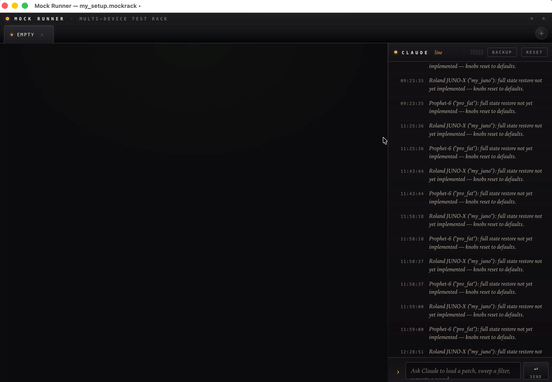

# Mock Runner

The Mock Runner is an Electron app that simulates one or more keyboards on your desktop so you can develop and test against the MCP server without real hardware. Each tab hosts an independent mock device on its own MIDI virtual port and its own WebSocket port, with a model-specific web UI that mirrors real-time parameter changes.

```bash
npm run mock:runner   # Electron — model picker, then per-model UI
npm run mock:headless --model nord-electro-5d   # Plain Node, for CI/E2E tests
```



## Anatomy

The shell is a two-column layout: the **rack column** on the left (chassis with tab bar + slot + MIDI monitor drawer), the **rail** in the middle (full window height, combined splitter + collapse toggle), and the **console drawer** on the right.

```
┌─────────────────────────────────────────────────────┬─┬──────────────────┐
│ MOCK RUNNER · [●tab][●tab][●tab][+]                 │ │ [CHAT●] [LOG●]   │
├─────────────────────────────────────────────────────┤ ├──────────────────┤
│                                                     │ │ SID:abc12345 ▮▮▮ │
│         (model UI iframe — drawbars, knobs,         │R│                  │
│          LEDs, parameter state for active tab)      │A│  > history…      │
│                                                     │I│                  │
│                                                     │L│                  │
├─────────────────────────────────────────────────────┤ │                  │
│ MIDI MONITOR                              0 events ▴│ │  › composer ↵    │
└─────────────────────────────────────────────────────┴─┴──────────────────┘
```

- **Chassis** — brand strip plus tab bar with a `+` button. Sits at the top of the **rack column only** (PR #82 made the rail full-height); the chassis no longer spans across the console. Each tab carries a status LED (see [Tab LEDs](#tab-leds-and-mcb)).
- **Slot** — the active tab's iframe. Each tab loads either the model picker (`chooser.html`) or, once a model is chosen, that model's web UI from `src/keyboard_models/<mfr>/<model>/web/`. Inactive tabs stay mounted but hidden.
- **Empty rack slot** — placeholder shown when no tabs are open.
- **MIDI monitor drawer** — collapsible strip at the bottom of the rack column showing the active tab's recent MIDI traffic (see [MIDI monitor](#midi-monitor)).
- **Rail** — full-height combined splitter + collapse toggle between the rack and the console. Drag to resize, click to collapse.
- **Console drawer** — tabbed pane on the right with **CHAT** (talk to the agent) and **LOG** (mock-runner event log). See [Console](#console--chat-and-event-log).

## Tabs and devices

The shell window is loaded once and never reloaded. Each tab owns its own `MockTransport`, MIDI virtual port, and WebSocket port (allocated sequentially from `3000`).

| Action | How |
|---|---|
| New tab | `+` on the tab bar, or **File → New Tab** (`Cmd+T`) |
| Close tab | `×` on the tab — transport shuts down, WebSocket port is freed |
| Pick a model | Click any card on the chooser screen |
| Switch active tab | Click a tab |
| Rename a tab | Double-click the tab title |

### Labels

Each loaded tab has a sanitized **label** (lowercase `[a-z0-9._-]`). It defaults to `<model-id>-1`, `<model-id>-2`, etc — collisions with other tabs of the same model are skipped automatically. The label is the cache key for that tab's per-instance backup data: it appears in `data/backups/<label>/`. Rename a tab to attach a different backup cache to it.

### Tab LEDs and MCB

The dot at the start of each tab title is a status LED reflecting that mock's role in [midi-connections-broker (MCB)](../README.md) leases:

| LED | Meaning |
|---|---|
| Amber (steady) | No active lease against this mock's WebSocket port — the default resting state. |
| Green | An MCP session holds this mock as the **primary** device. |
| Blue | Held as the **shadow** of another device (mirror destination — typical hw + mock pair). |
| Blinking amber (all tabs) | MCB is unreachable; the broker-liveness state pushes "down" to every tab until it comes back. With the broker down, the lease-state poll collapses every tab to "none" (amber) and the blink pulses opacity on top of that. |

The shell polls MCB every 2 s for lease state, and registers a broker-liveness subscriber so the "down" / "up" transitions arrive as push notifications (no polling on the renderer side). MCB lives in `src/shared/mcb-client.ts`; the mock-runner is not a hard dependent — if MCB is down, mocks still run, the LEDs just collapse to "none".

### MIDI monitor

The drawer pinned to the bottom of the rack column shows the active tab's recent MIDI traffic.

- **Collapsed** (default): a single row with the latest event from the active tab's ring buffer.
- **Expanded** (click the chevron `▴`): a scrollable list of all buffered events for that tab, newest at the bottom. The operator's scroll position is preserved during MIDI bursts.
- Ring buffer cap: **50 events per tab**.
- Format is generic — no model-specific interpretation. Sysex shows the full hex string (the row truncates visually but the underlying text node carries every byte so you can select-and-copy).

```
▸ OUT 14:32:08.512  CC93=32 ch=0
◂ IN  14:32:08.514  sysex 17 bytes [F0 41 10 00 00 00 12 11 01 50 00 01 01 00 00 5C F7]
▸ OUT 14:32:08.520  PC=12 ch=2
```

Events arrive from each tab's `MockTransport` via the `midi-event` EventEmitter signal, relayed through Electron IPC. The transport itself does no model-specific interpretation. The drawer receives the **full** byte array for every event (so select-and-copy works on long sysex); stdout's `MIDI-IN` / `MIDI-OUT` log lines summarize long sysex packets as `[<first 4 bytes> .. <last byte>]` for readability.

## Model picker

A new tab opens to the chooser, which lists every model auto-discovered under `src/keyboard_models/<manufacturer>/<model>/`. Cards show manufacturer, display name, and model id. Clicking a card spins up the transport for that tab and navigates the iframe to the model's web UI. The chooser runs inside the iframe and asks the parent shell for the catalog via `postMessage` — the preload-bridged `mockRunnerAPI` only exists on the parent.

## Model UI

Each model ships its own UI under `src/keyboard_models/<mfr>/<model>/web/`. The shell injects the per-tab `wsPort` via the URL query string; the UI opens a WebSocket back to that port and re-renders on every full-state broadcast it receives. Drawbars, knobs, LEDs, and parameter values update both when external MIDI arrives on the virtual port and when another client (the agent via MCP, a real keyboard via a bridge) writes to the mock.

Model UIs speak the **param domain only** — never raw MIDI. To change a parameter, the UI sends `{type:"setParam", name, value, part?}` over the WebSocket; the transport calls `handler.set_params([...])` for state and then asks the codec to encode the same write to MIDI Out bytes (the panel-knob analogue, so external listeners see the change). To change the active engine on a part (JUNO-X), the UI sends `{type:"setActiveEngine", engine, part?}`. To request a cache reload after a backup extract, `{type:"reload-cache"}`.

The transport is a thin shell (virtual MIDI port + WebSocket server + broadcast + small protocol-state glue). All model semantics live in the per-model `MockHandler` (state) and `MidiCodec` (param ↔ MIDI translation). See [Transport, codec, handler — runtime contract](#transport-codec-handler--runtime-contract) for the boundary and [`src/mock-runner/transport.md`](../src/mock-runner/transport.md) for the transport file walkthrough.

## File menu — saving and restoring rack setups

Save the entire rack (all tabs, their models, labels, and full state) to a single `.mockrack` JSON file and reload it later.

| Item | Shortcut | What it does |
|---|---|---|
| New Tab | `Cmd+T` | Open a chooser tab |
| Open… | `Cmd+O` | Replace the rack with a `.mockrack` file |
| Open Recent | — | macOS recents submenu |
| Save | `Cmd+S` | Save to the current file (falls back to Save As) |
| Save As… | `Cmd+Shift+S` | Save to a new path |
| Extract Backup… | `Cmd+E` | See [Backup extraction](#backup-extraction) |

### Dirty indicator

The title bar reads `Mock Runner — <file>.mockrack` and gains a trailing `•` whenever the rack diverges from the saved file. Engine state changes are debounced (250 ms). Tab create/close, model selection, rename, active-tab change, and backup extraction all mark the rack dirty.

### Confirmation prompts

Quit (`Cmd+Q`), close window, and Open all prompt **Save / Don't Save / Cancel** when the rack is dirty.

### Auto-load

On launch, a queued `open-file` event from the OS (file association double-click, dock drop) wins. Otherwise the shell walks the recents list and auto-loads the most-recent surviving file. If neither exists, the rack starts empty.

### Restore semantics

Each tab's full state is captured via `MockHandler.getFullState(false)` and restored via `MockHandler.setFullState(snapshot)`. Models opt in incrementally — those without `setFullState` restore as model + label only, with knobs at defaults; an in-shell note explains. Unknown models in a `.mockrack` are skipped with a console note rather than failing the load.

## Backup extraction

Use the **backup** button in the console header (or **File → Extract Backup…**, `Cmd+E`) to import a backup into the active tab's cache.

- A native file picker accepts a single backup file or a programs-only folder.
- With **one** loaded tab, extraction runs against it directly.
- With **multiple** loaded tabs, a modal asks which device the backup belongs to.
- Programs-only folder extraction merges into the existing cache for that label — it requires a previously cached full backup under the same label.
- After extraction, the live transport for that model + label reloads its cache; a markdown inventory is written to `data/backups/<label>/<model_slug>_backup_inventory.md`.

## Console — chat and event log

The right-hand pane is a tabbed drawer with two panes that share one strip of chrome and one composer:

- **CHAT** — talk to the sibling `sound-recreation-agent`. Uses the `@sounds-and-recreation/agent-client` SDK over SSE.
- **LOG** — mock-runner event log. Lifecycle and status notes from the main process appear here (backup extracted, snapshot restore notes, etc.) instead of polluting the chat.

The drawer collapses by clicking the rail between rack and console; the rail is also a drag handle to resize the console (width persists across launches).

### CHAT pane

The chat tab's header strip carries a status meter and the agent's session id:

- **Lamp + meter** — four states:
  - `unknown` — page just loaded, no probe yet
  - `live` — last probe or chat turn succeeded
  - `busy` — chat in flight (overlays `live`/`lost` while sending)
  - `lost` — probe or fetch failed; the agent is unreachable
- **SID** — the agent's MCB-issued sessionId, shown as the first 8 hex chars (full UUID in the title attribute). Changes if the agent restarts. Sourced from the agent's `GET /health` response.
- **Composer** — `Enter` sends, `Shift+Enter` inserts a newline.
- **Stream events** — `text` chunks build up the assistant message; `tool_use` rows show the tool name plus a short input summary; `tool_result` rows show the first 220 chars of the result (highlighted on error). Web-search source URLs are rendered as links.
- **Reset** — **File → Reset Chat** clears the on-screen log and posts `POST /reset` to the agent.
- **History** — every row is persisted to `localStorage` (`mock-runner.chat-history.v1`) and replayed on next launch.

The agent is expected at `http://localhost:2999`. Port 2999 is reserved for the agent so it doesn't collide with mock WebSocket ports (which start at 3000 and count up). Start it from the sibling repo:

```bash
cd ../sound-recreation-agent
npm run dev:full
```

### LOG pane

Mock-runner lifecycle events tagged by severity (`info` / `warn` / `error`). Events arrive from the main process via `event-log-ipc.ts`. When the LOG tab is inactive, an unread LED appears on its tab; the LED's color matches the highest unread severity. Selecting the tab clears the unread state.

**File → Clear Event Log** (`Cmd+K`) clears the log when LOG is active (no-op when CHAT is active).

## `.mockrack` file format

A small JSON envelope wrapping each tab's modelId, label, and an opaque state blob owned by the model.

```jsonc
{
  "$schema": "mockrack/v1",
  "version": 1,
  "savedAt": "2026-05-04T10:30:00.000Z",
  "appVersion": "0.1.0",
  "activeTabIndex": 0,
  "tabs": [
    {
      "modelId": "nord-electro-5d",
      "label": "studio-a",
      "state": { /* opaque, model-defined */ }
    }
  ]
}
```

Writes are atomic (`tmp` + `rename`). The format is versioned so older files can be migrated forward.

## Headless mode

For tests and CI, `mock:headless` runs the same `MockTransport` under plain Node (no Electron, no UI). It prints `MOCK_READY` on stdout once the WebSocket server is up.

```bash
npm run mock:headless -- --model nord-electro-5d --ws-port 3000
# flags: --model <id>            (required)
#        --ws-port <n>           (default 3000)
#        --lower-channel <ch>    (default 0)
#        --upper-channel <ch>    (default 1)
#        --no-midi               (skip the virtual MIDI port — useful in CI containers)
#        --label <name>          (override the per-instance label)
```

Tests use this via `tests/helpers/mock-process.ts` (headless spawn + WebSocket assertions) and `tests/helpers/test-harness.ts` (full mock + MCP client harness).

## Architecture quick reference

| Path | Role |
|---|---|
| `src/mock-runner/main.ts` | Electron main — owns tabs, transports, file menu, IPC |
| `src/mock-runner/cli.ts` | Headless entry point |
| `src/mock-runner/transport.ts` | `MockTransport` — MIDI virtual ports + WebSocket server + broadcast + routing glue |
| `src/mock-runner/transport.md` | File-level walkthrough of `transport.ts` |
| `src/mock-runner/preload.cjs` | Exposes `mockRunnerAPI` to the shell |
| `src/mock-runner/event-log-ipc.ts` | Main → renderer event log channel |
| `src/mock-runner/shell/index.html` | Tab bar, slot, MIDI drawer, console drawer, backup picker |
| `src/mock-runner/shell/app.js` | Tab routing, MIDI drawer, chat + event log, MCB LED polling, splitter, dirty/title sync |
| `src/mock-runner/shell/chooser.html` | Model picker iframe |
| `src/shared/midi-codec.ts` | `MidiCodec` interface — param ↔ MIDI translation, shared by mock + MCP |
| `src/shared/mcb-client.ts` | HTTP-over-UDS client for midi-connections-broker (lease queries + broker-liveness) |
| `src/shared/mock-registry.ts` | At-rest index of running mocks, written by each `MockTransport` |
| `src/shared/mockrack-format.ts` | `.mockrack` schema, parse, atomic write |
| `src/keyboard_models/<mfr>/<model>/mock-handler.ts` | Per-model state — `set_params` / `get_params` / `getFullState` / `setFullState` |
| `src/keyboard_models/<mfr>/<model>/midi-codec.ts` | Per-model codec implementation |
| `src/keyboard_models/<mfr>/<model>/web/` | Per-model UI loaded into the tab iframe |

## Transport, codec, handler — runtime contract

The mock runner has three collaborators per tab: a **MockTransport** (transport), a per-model **MidiCodec** (param ↔ MIDI translation), and a per-model **MockHandler** (state). The boundary is plan #30 stage 5 (#74–#79): the handler is **purely param-domain** — no MIDI bytes, no addresses, no protocol awareness. The transport and codec own everything wire-related.

### Topology

```
┌────────────────────────────────────────────────────────────────────────┐
│                    MockTransport (transport)                           │
│   - WebSocket server   - Virtual MIDI ports   - Routing glue           │
│   - Broadcasts state   - Bank-select accumulator   - RQ1 fulfillment   │
└────────────────────────────────────────────────────────────────────────┘
         ▲                                    ▲                ▲
         │ WS                                 │ MIDI In        │ MIDI Out
         │                                    │ (apps→device)  │ (device→apps)
         ▼                                    ▼                ▼
   ┌──────────┐  ┌──────────┐         ┌────────────┐    ┌────────────┐
   │ UI client│  │MCP-status│         │ External   │    │ External   │
   │ (browser)│  │ client   │         │ MIDI src   │    │ MIDI sink  │
   └──────────┘  └──────────┘         │ (MCP, real │    │ (MCP, real │
                                      │ kbd, bridge│    │ kbd, bridge│
                                      └────────────┘    └────────────┘

      ↕ in-process method calls (no MIDI here)
   ┌────────────────────────┐    ┌────────────────────────────────┐
   │   MidiCodec (model)    │    │      MockHandler (model)       │
   │  - encodeParams        │    │  - set_params / get_params     │
   │  - encodeBytes         │    │  - load_program                │
   │  - decode              │    │  - get_active_engine /         │
   │  - paramsAtAddress     │    │    set_active_engine           │
   │  - parseRequest        │    │  - getFullState /              │
   │  - buildResponse       │    │    setFullState                │
   └────────────────────────┘    │  - state: parts[], scene, etc. │
                                 └────────────────────────────────┘
```

The transport creates two virtual MIDI ports per tab (the device's MIDI In, where apps write to it; the device's MIDI Out, where apps read from it) and one WebSocket server. UI clients receive full state snapshots; a separate "MCP-status" WebSocket client receives a label-only payload (used by MCP-side label discovery — see `mcb-client.ts`).

### Responsibility split

| Concern                                       | Transport | Codec | Handler |
|-----------------------------------------------|:---------:|:-----:|:-------:|
| Virtual MIDI In / Out lifecycle               |     ✓     |       |         |
| WebSocket server + clients + broadcasts       |     ✓     |       |         |
| Bank-select CC 0/32 accumulator               |     ✓     |       |         |
| RQ1 fulfillment orchestration                 |     ✓     |       |         |
| Default-channel resolution on emit            |     ✓     |       |         |
| Parameter map (name → CC / sysex addr)        |           |   ✓   |         |
| Encoding (user-domain value → wire bytes)     |           |   ✓   |         |
| Decoding (wire bytes → user-domain refs)      |           |   ✓   |         |
| RQ1 address ↔ param lookup                    |           |   ✓   |         |
| State updates (parts, scene, etc.)            |           |       |    ✓    |
| Per-part active-engine selection              |           |       |    ✓    |
| Snapshot save/restore                         |           |       |    ✓    |

The transport is a dumb pipe + small protocol glue. The codec is the model's translator. The handler is the model brain — pure param domain.

### Inbound message flows

Two groups, seven flows total. From the wire: UI `setParam`, external MIDI param write (CC or non-request sysex), external bank-select + Program Change (transport accumulates MSB/LSB), and codec-recognized request sysex (today: Roland RQ1, but the mechanism is generic). From the host: WebSocket client connect (with the partial-broadcast MCP-status quirk), tab relabel + cache reload, and `.mockrack` save/restore. Each is documented with diagrams in [`src/mock-runner/transport.md`](../src/mock-runner/transport.md#inbound-message-flows) alongside the transport's other internals.

### See also

- [`src/mock-runner/transport.md`](../src/mock-runner/transport.md) — file-level walkthrough of `transport.ts` (every entry point, every protocol-state bit).
- [`src/shared/midi-codec.ts`](../src/shared/midi-codec.ts) — the `MidiCodec` interface contract.
- [`src/shared/keyboard-model.ts`](../src/shared/keyboard-model.ts) — the `MockHandler` interface contract.
