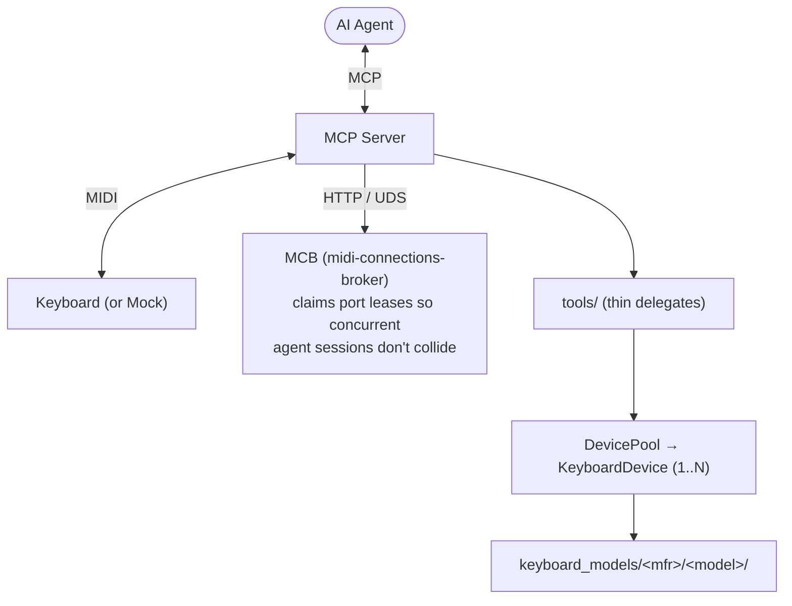

# keyboards-mcp

An MCP (Model Context Protocol) server for controlling MIDI keyboards. Supports pluggable keyboard models with auto-detection. Designed to be used with any MCP-compatible AI agent or assistant.

Currently supported: **Nord Electro 5D**, **Roland JUNO-X**, **Prophet-6**

## What it does

- **Connect** to a keyboard over USB MIDI by port name and model id, with an optional mock-UI shadow port
- **Read and change parameters** — piano type/model, organ drawbars, effects, EQ, reverb, delay, and more
- **Load programs** by bank and slot number
- **Load set list songs** by bank, slot, and part
- **Browse inventory** — list programs and songs from extracted backups with name and bank filtering
- **Extract backup files** into a structured inventory of all sounds, programs, and set lists
- **Develop without hardware** using the companion [Sounds and Recreation app](../sounds-and-recreation-app/README.md) — mock keyboards with model-specific web UIs, plus a Song Analysis workbench

## Architecture

**Model-delegated design.** MCP tools are thin wrappers — keyboard models own all business logic.



A **KeyboardModel** is a type of keyboard (e.g., "Nord Electro 5D"). It owns shared definitions (parameter map, system prompt, backup parsing) and acts as a factory for device instances.

A **KeyboardDevice** is a specific physical unit or mock instance. Each device has its own MIDI connection, state, and backup data. Multiple devices of the same model can coexist.

The **midi-connections-broker (MCB)** is a separate long-running process that owns MIDI port leases. The MCP server claims a lease via MCB on `connect_to_keyboard` and releases it on `disconnect_from_keyboard`, so multiple agent sessions can share a host without stepping on each other's ports. MCB also exposes the canonical port list and reaps leases held by dead processes.

### Key directories

| Path | Description |
|------|-------------|
| `src/index.ts` | MCP server entry point |
| `src/tools/` | MCP tool registrations (thin wrappers that delegate to device methods) |
| `src/shared/` | Shared interfaces: KeyboardModel, KeyboardDevice, MidiConnection, MockHandler, mcb-client |
| `src/keyboard_models/` | Pluggable keyboard models (`<manufacturer>/<model>/`) |
| `src/midi/` | MIDI I/O manager (implements MidiConnection) |
| `src/mcb/` | midi-connections-broker — lease registry, session manager, HTTP-over-UDS API |

> The **Sounds and Recreation** desktop app (and its `audio-analysis-client`) now live in a separate workspace package, `sounds-and-recreation-app`, which depends on this package and imports its shared model logic via `keyboards-mcp/shared/*`.

### Adding a new keyboard model

Create a directory under `src/keyboard_models/<manufacturer>/<model>/` with:

- `index.ts` — Default export implementing the `KeyboardModel` interface
- `device.ts` — Class implementing `KeyboardDevice` (owns connection, state, all tool logic)
- `midi-map.ts` — Parameter definitions with CC mappings and/or SysEx addresses
- `mock-handler.ts` — Optional `MockHandler` implementation for the mock device
- `web/` — Optional mock device web UI (HTML/CSS/JS)

The model is auto-discovered at startup. See `src/keyboard_models/nord/electro_5d/` for a CC-based reference implementation, or `src/keyboard_models/roland/juno_x/` for a model using both CC and Roland DT1/RQ1 SysEx addressing.

## Quick Start (macOS)

**Prerequisites:** macOS, Node.js 20+, and a supported keyboard connected via USB.

```bash
npm install -g keyboards-mcp     # 1. install
keyboards-mcp install            # 2. install + start the broker daemon (launchd)
```

Then add this to your MCP client config (e.g. `.mcp.json` / Claude Code settings) and restart the client:

```json
{
  "mcpServers": {
    "keyboards-mcp": {
      "command": "keyboards-mcp"
    }
  }
}
```

That's it. The **midi-connections-broker (MCB)** is now a launchd daemon that starts at login and is
kept alive automatically — you never run it by hand. Ask your agent to `connect_to_keyboard`.

- Check broker status anytime: `keyboards-mcp doctor` (logs at `~/.mcb/mcb.log`).
- Remove the daemon: `keyboards-mcp uninstall`.

> No hardware? The **Sounds and Recreation** desktop app (a visual device simulator) is a separate
> workspace package — see the [Sounds and Recreation README](../sounds-and-recreation-app/README.md).
> This npm package targets owners of real MIDI hardware.

## Development (from source)

This package is one workspace of the [`keyboards-mcp` monorepo](https://github.com/uribrecher/keyboards-mcp).
Clone the monorepo, install once at its root (which wires up both workspaces), then build:

```bash
npm install                                          # at the monorepo root — both workspaces
npm run build -w keyboards-mcp                        # → packages/keyboards-mcp/dist/
node packages/keyboards-mcp/dist/cli/index.js install # run the BUILT entry so the daemon is node-runnable
                                                      # (or: keyboards-mcp install after a global link)
```

`keyboards-mcp broker` runs the broker in the foreground (the daemon's entry point), or
`npm run mcb -w keyboards-mcp` from source. The headless mock and the Electron Sounds and
Recreation app live in the sibling `sounds-and-recreation-app` workspace —
`npm run sar:headless -w sounds-and-recreation-app` / `npm run sar -w sounds-and-recreation-app`.

## Releasing

This package publishes to npm via **[Changesets](https://github.com/changesets/changesets)** from
the monorepo — automated by `.github/workflows/release.yml` with npm OIDC Trusted Publishing, no
manual version tags. Ship a changeset on any source PR (`npm run changeset`). The full flow
(Version Packages PR, publishing, trusted-publishing setup) is documented once, in the
[monorepo README](https://github.com/uribrecher/keyboards-mcp/blob/main/README.md#releasing).

## Usage

### MCP tools

Once connected, the following tools are available:

| Tool | Description |
|------|-------------|
| `list_midi_devices` | List available MIDI ports |
| `connect_to_keyboard` | Claim an MCB lease and connect to the keyboard (`port` + `model` required, optional `with_shadow` mock label) |
| `disconnect_from_keyboard` | Disconnect from the keyboard |
| `is_connected` | Check connection status |
| `set_parameters` | Change one or more parameters by name and value |
| `get_current_state` | Read current parameter values from the device. Per-model: Nord and Prophet-6 return "not supported" (one-way MIDI); JUNO-X uses Roland RQ1 to query the device live for scene-effect sections (chorus/delay/reverb/drive). |
| `list_parameters` | List all controllable parameters with ranges and labels |
| `list_programs` | Browse stored programs from backup inventory (filter by name or bank) |
| `list_songs` | Browse set list songs from backup inventory (filter by name or bank) |
| `load_program` | Switch to a program by bank/slot |
| `load_song` | Load a set list song by bank/slot/part |
| `extract_backup` | Parse a backup file into a full inventory (no connection required) |
| `get_last_backup_location` | Get the path of the last extracted backup |
| `get_system_prompt` | Get the keyboard's signal path, capabilities, and sound design guidelines |

### Developing without hardware

The **Sounds and Recreation** desktop app simulates one or more keyboards — a tabbed mock rack with model-specific web UIs, persistent setups, a chat console, and a Song Analysis workbench — so you can drive this MCP server with no MIDI hardware. It's a separate workspace package; see the **[Sounds and Recreation README](../sounds-and-recreation-app/README.md)** for running it (`npm run sar -w sounds-and-recreation-app`), the headless mock used by tests/CI, and building the standalone `.app`.

## License

Licensed under the GNU General Public License v3.0 (GPL-3.0-or-later). See [LICENSE](LICENSE).