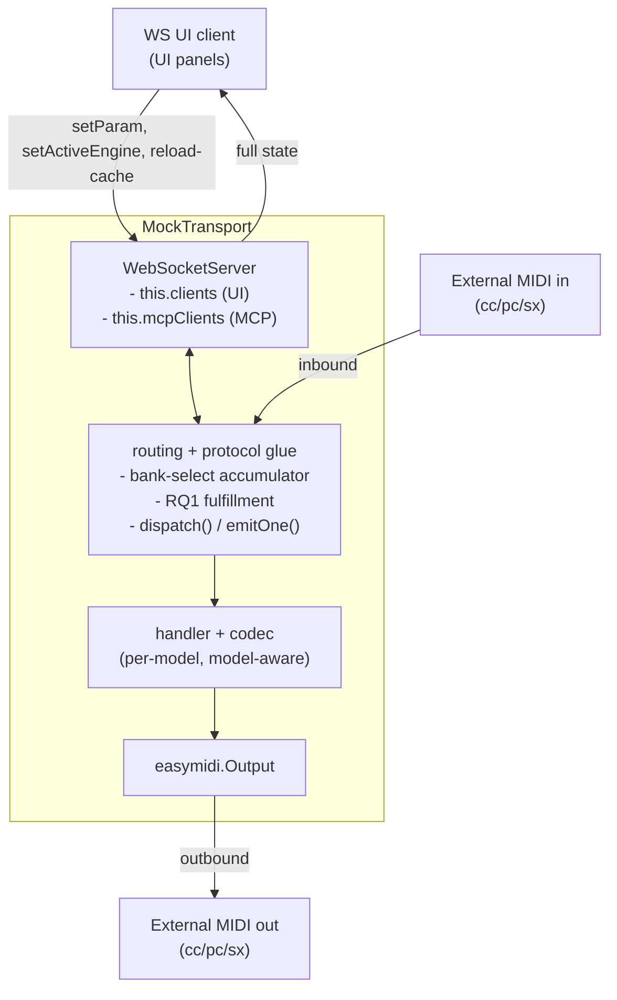
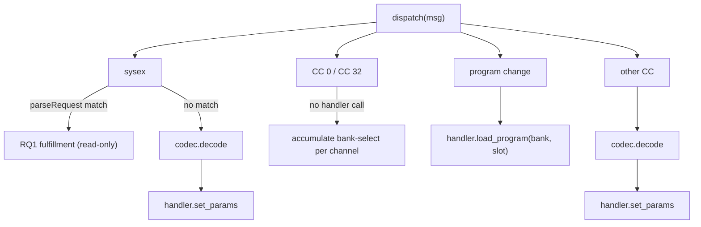
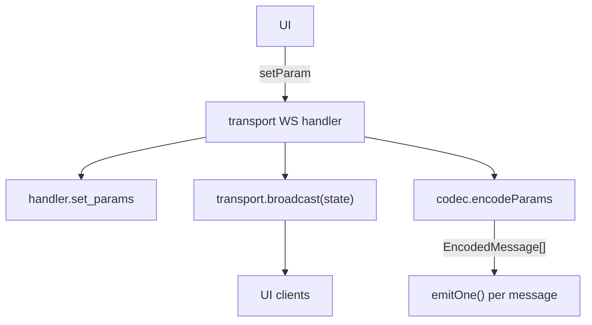
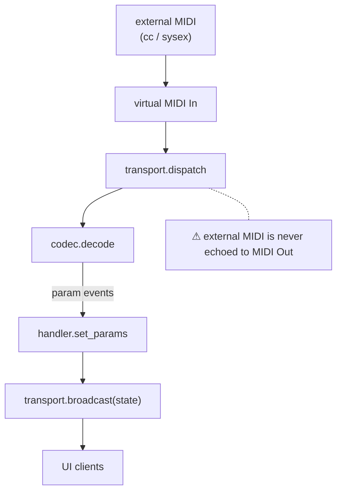
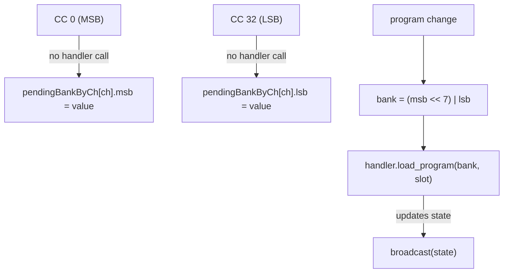
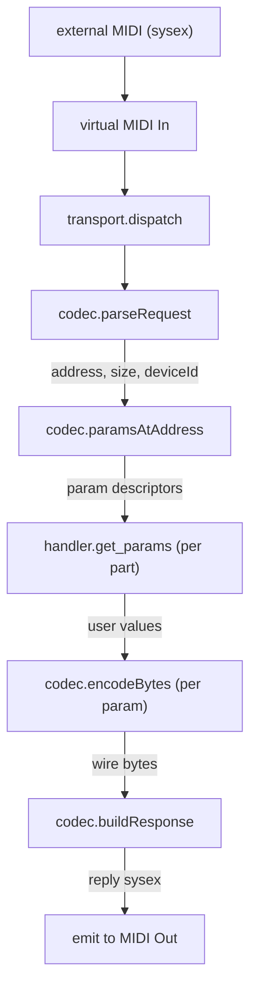
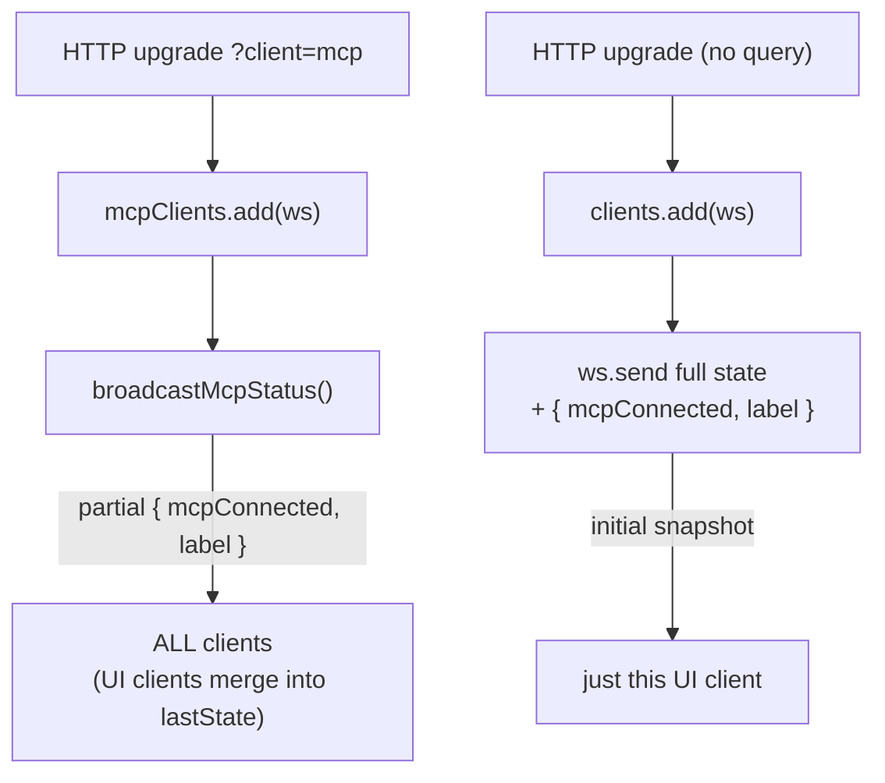
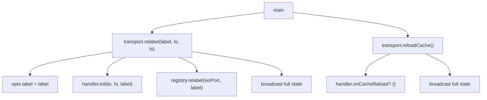
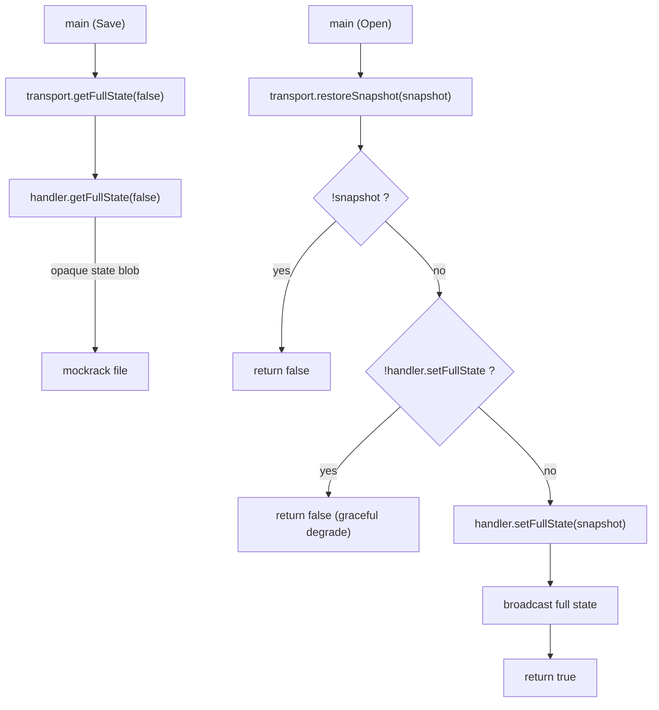

# `transport.ts` — `MockTransport`

> **About the name.** Previously called `MockEngine`. Renamed because this file owns no model logic — it's mostly a router with a small amount of protocol state. All model semantics live in the per-model `MockHandler` and `MidiCodec`.

## Responsibilities

The transport owns three things:

1. **Transport.** One virtual MIDI port (in + out) + one WebSocket server, per mock instance. In WS-only mode (no virtual MIDI) an optional **second WS server — the "out lane" (`wsOutPort`, #109)** — carries outgoing-from-mock SysEx so a WS-transport MCP can receive the RQ1→DT1 round-trip.
2. **Routing.** WS messages → handler methods. External MIDI → codec/handler.
3. **A small amount of stateful protocol glue** that neither the codec (stateless) nor the handler (model-agnostic transport) can own:
   - Bank-select accumulator (CC 0 / CC 32) before a Program Change.
   - RQ1 → DT1 fulfillment for Roland devices.
   - Default-channel resolution on emit.
   - MCP-connection bookkeeping, label, registry heartbeat.

What it does **not** own: parameter values, MIDI map, engine selection, backup data, anything model-specific. Those all live in the `MockHandler` (state) and `MidiCodec` (param ↔ MIDI translation).

## Topology

## WebSocket clients

The transport accepts two kinds of WebSocket clients, distinguished by `?client=mcp` on the connect URL:

| Client | Set | Receives | Sends |
|---|---|---|---|
| UI (default) | `this.clients` | Full state snapshots (+ `mcpConnected`, `label`) | `setParam`, `setActiveEngine`, `reload-cache`, and (WS-only mode) raw MIDI `cc`/`program`/`sysex` |
| MCP server | `this.mcpClients` | `{mcpConnected, label}` only — for label discovery and live status | nothing |

A third, optional server — the **out lane** (`wsOutPort`, #109) — is **broadcast-only**: its clients (`this.wsOutClients`) receive `{type:"sysex", bytes}` for every outgoing SysEx and the server never reads inbound messages. The MCP's `WsMidiConnection` *sends* inbound MIDI on the main port and *listens* on the out lane — a clean unidirectional split that cannot form a feedback loop.

`broadcast()` fans out to both sets but sends different payloads, and stamps every payload with `mcpConnected` (current size of `mcpClients > 0`) and `label` (the per-instance backup label). `broadcastMcpStatus()` sends the label-only payload to both sets on MCP connect/disconnect (so UIs can flip their "MCP connected" indicator). The partial-broadcast nature of `broadcastMcpStatus()` is the reason UI clients must *merge* incoming payloads into their cached `lastState` rather than replace — Flow 5 has the detail.

## Inbound WS message types

Handled in the `ws.on("message", ...)` block:

| `msg.type` | What the transport does |
|---|---|
| `setParam` | `handler.set_params([{name, value, part}])`, broadcast resulting state, then `codec.encodeParams(...)` → `emitOne()` for each encoded message (UI is a closed-loop source — panel-knob analogue). |
| `setActiveEngine` | `handler.set_active_engine(part, engine)` if implemented; broadcast the new state. |
| `reload-cache` | `handler.onCacheReload?.()` then broadcast a fresh full state snapshot. Used after `extract_backup`. |
| `cc` / `program` / `sysex` | Raw MIDI from the MCP's `WsMidiConnection` in WS-only mode. Routed through `ingestExternalMidi()` → `dispatch()` — treated exactly like external MIDI on the virtual In, so it updates state and is **never echoed back** (only an RQ1 emits, on the out lane). |
| anything else | Silently ignored (the outer `try { ... } catch {}` swallows malformed JSON too). |

Adding a new WS message means adding a branch here. Each branch is a thin call into a handler method.

## Inbound MIDI dispatch

`dispatch(msg: MidiMessage)` routes everything from the virtual MIDI Input. Source is implicitly **external** — the transport **must not** echo inbound MIDI back out (would feedback-loop on bridges/shadows).

### RQ1 → DT1 fulfillment (`fulfillRequest`)

Transport-side because it's a pure read: codec describes which params live in the requested address range; handler returns their user-domain values; codec packs each one back to wire bytes; codec builds the reply sysex; transport emits it. Handler is read-only — no state mutation. See `paramsAtAddress` / `encodeBytes` / `buildResponse` on the `MidiCodec` interface.

### Bank-select accumulator (`pendingBankByCh`)

CC 0 (MSB) and CC 32 (LSB) on their own mean nothing — they're stateful predecessors to a Program Change. The codec is stateless by design, so the transport accumulates them per channel and only finalizes a `handler.load_program(bank, slot)` call when the matching PC arrives.

## Inbound message flows

These flows cover everything that mutates state or emits to the wire. They split into two groups: traffic coming in from the wire (WebSocket or virtual MIDI In), and external method calls from the host (main process / CLI).

### From the wire

#### Flow 1 — UI sets a parameter

The UI never touches MIDI bytes; it sends a named param write over the WebSocket. The transport updates state via the handler, then asks the codec to encode the same write and emits it on MIDI Out (the panel-knob analogue — external listeners see the change).

The encoded write carries the full named payload `{type: "setParam", name, value, part?}`; `codec.encodeParams` returns `EncodedMessage[]` (e.g. `{type: "cc", controller, value, channel?}` or `{type: "sysex", bytes: […]}`), and the transport emits each via `emitOne()`.

If `codec.encodeParams` throws (unknown param, transport-less param), the transport catches and logs `setParam emit failed` and continues — state was still updated and broadcast.

`{type:"setActiveEngine", engine, part?}` follows the same shape but routes to `handler.set_active_engine`, which preserves inactive engines' state (JUNO-X has per-part engines: ZEN-Core, Analog Synth, JUNO-X Model, RD Piano).

`{type:"reload-cache"}` calls `handler.onCacheReload?.()` and broadcasts a fresh full state — used after `extract_backup` rewrites the on-disk cache. (The same effect is also reachable via the public `transport.reloadCache()` method — see Flow 6.)

#### Flow 2 — External MIDI param write (CC or non-request sysex)

Any MIDI message that arrives on the virtual In and is *not* a bank-select CC, *not* a Program Change, and *not* a codec-recognized request (Flow 4) falls through here. The codec decodes; the handler applies. External MIDI is never echoed back to MIDI Out — a bridge that fans out would loop the message right back into our own In.

`codec.decode` returns `param` events shaped `{kind: "param", name, value, part?, engine?}`. CC-only codecs (Nord, Prophet-6) handle CC writes here and return `[]` for sysex. Roland-style codecs (JUNO-X) handle CC *and* inbound DT1 sysex writes via the same path.

`codec.decode` may return **multiple** `param` events for one CC when the controller is ambiguous (JUNO-X emits one candidate per matching engine; the handler picks based on the part's `activeEngine` and silently ignores non-matches). `applySetEvents` rolls all returned `param` events into a single `handler.set_params(refs)` call; `unknown`-kind events are logged and dropped.

#### Flow 3 — External Program Change (with bank-select accumulator)

CC 0 (bank MSB) and CC 32 (bank LSB) on their own mean nothing — they're stateful predecessors to a Program Change. The codec is stateless by design, so the **transport** accumulates MSB/LSB per channel and finalizes a `handler.load_program(bank, slot)` call when the matching PC arrives.

#### Flow 4 — Codec-recognized request sysex (transport-fulfilled, handler read-only)

When an inbound sysex matches `codec.parseRequest`, the transport orchestrates a read-only round-trip entirely through the codec; the handler just returns the requested params' values. Today this is wired for Roland RQ1 → DT1 on the JUNO-X model — but the mechanism is generic. Any codec that implements `parseRequest` + `paramsAtAddress` + `encodeBytes` + `buildResponse` gets the same fulfillment.

If `codec.parseRequest` returns `undefined`, the message falls through to Flow 2. The handler never sees raw MIDI here. Adding a new addressable-param read on a Roland-style model means extending the per-model codec's `paramsAtAddress` — no transport changes.

### From the host (external method calls)

The main process (`main.ts`) and the headless CLI (`cli.ts`) call into the transport directly for tab lifecycle and `.mockrack` save/load. These bypass the WebSocket entirely.

#### Flow 5 — Client connect

UI clients and MCP-status clients connect to the same WebSocket port, distinguished by `?client=mcp` on the URL.

The full snapshot is `handler.getFullState(true)` stamped with `{ mcpConnected, label }`. MCP disconnect fires `broadcastMcpStatus()` again with `mcpConnected:false`. Every regular `broadcast()` also stamps the current `mcpConnected` flag and `label` onto the state payload — UI panels mirror it for the "MCP connected" indicator.

Because `broadcastMcpStatus()` sends a **partial** payload (no `part1..partN`), UI clients that cache the last broadcast must *merge* the new fields in rather than replace the whole cache, or part state evaporates on the next MCP connect/disconnect.

#### Flow 6 — Tab relabel / cache reload

The main process calls these directly during tab rename (`relabel`) and after on-disk backup extraction (`reloadCache`). Both end in a fresh full-state broadcast so connected UIs see the new label or new inventory.

`relabel` re-loads the per-instance backup cache under the new label (`handler.init`) and updates the mock-registry entry (`registry.relabel`); both paths broadcast `handler.getFullState(true)`. `{type:"reload-cache"}` over the WebSocket (Flow 1's tail) reaches the same handler path; `transport.reloadCache()` is the equivalent for callers inside the same process.

#### Flow 7 — `.mockrack` save / restore

The save side is read-only. The restore side calls the handler's `setFullState` and broadcasts once for a clean UI transition.

`handler.setFullState` may throw — the transport catches it and returns `false`. Models that don't implement `setFullState` restore as model + label only with knobs at defaults; the shell notes that to the operator.

### Source-aware emission

The only source-aware rule is: **external MIDI is never echoed back to MIDI Out** (loop prevention on bridges). UI writes always emit (the panel-knob mirror). Transport-fulfilled emissions (request-protocol replies in Flow 4) emit on their own path. There's no `source` flag on a dispatcher — the rule is implicit in which entry point fires (WS `setParam` vs. virtual MIDI In listener).

## Outbound — `emitOne`

Called from two paths: outbound after `setParam` (encoded by codec) and outbound from RQ1 fulfillment (the DT1 reply). Resolves the default channel (codec contract: `channel === undefined` → use the connection's default, which on the mock side is `opts.lowerChannel`). Sends to `easymidi.Output` (when present) and emits a structured `midi-event` only *after* `send` returns successfully — otherwise the per-tab MIDI drawer would show traffic that never reached the wire.

When an out lane (`wsOutPort`, #109) is configured, every outgoing **SysEx** is also broadcast to its clients as `{type:"sysex", bytes}` (`broadcastWsOut`). This runs even with **no** virtual MIDI Out — in WS-only mode the out lane *is* the wire, so `emitOne` no longer early-returns on a missing `midiOutput`. Because `emitOne` is only ever reached for genuinely outgoing traffic (RQ1 replies + UI panel-knob writes) and never to echo external input, the out-lane broadcast inherits the no-loop guarantee. SysEx-only by design: the lane is the RQ1→DT1 response stream the MCP listens for, not a mirror of every CC.

## Telemetry

Two channels alongside the `console.log` lines:

- `midi-event` (EventEmitter) — structured `{direction, kind, ...}` payload with the *full* sysex byte array. Consumed by the mock-runner shell to render the per-tab MIDI drawer (50-event ring buffer per tab, #82).
- `state-changed` (EventEmitter) — fires after every broadcast. Consumed by the main process to flip the `.mockrack` dirty flag without subscribing to WS messages (plan #9).

The stdout `summarizeSysex` format trims long sysex packets (head ≤4 bytes + tail 1 byte) for log readability. The structured payload always carries the full bytes.

## Lifecycle

| Method | When | Notes |
|---|---|---|
| `start()` | Once at construction. | Initializes handler, creates virtual MIDI port (unless `noMidi`), starts HTTP+WS (and the out-lane HTTP+WS when `wsOutPort` is set), captures the OS-assigned port name (Core MIDI suffixes duplicates: "Foo", "Foo1"), publishes to the runtime registry once both servers are listening. |
| `reloadCache()` | After `extract_backup` writes new backup data to disk. | Tells the handler to re-read caches, then broadcasts a fresh full state. |
| `relabel(label, lo, hi)` | Hot label swap from `main.ts` (e.g. tab rename). | Re-inits handler under a new label without tearing the WS or MIDI port. Updates the registry entry's label too. |
| `getFullState(...)` / `restoreSnapshot(...)` | `.mockrack` save / load (plan #9). | Snapshot/restore round-trip; restore broadcasts once for consistent UI transition. Returns false when the handler doesn't implement `setFullState`. |
| `stop()` | Tab close, app quit. | Clears heartbeat timer, unregisters from the registry, closes MIDI ports + WS clients + HTTP server (+ the out-lane clients + server when present). |

## Mock registry & heartbeat

`publishToRegistry()` writes an entry to the shared mock registry (`shared/mock-registry.ts`) so other processes — most importantly the MCP server's `list_midi_devices` — can discover this mock and drop entries left by crashed processes. A 30-second heartbeat refreshes `lastTouched`; `stop()` unregisters explicitly.

Tests pass `noRegistry: true` to skip this and avoid cross-test pollution.

## Things the transport deliberately does NOT do

These are easy to misattribute to the transport. They all live elsewhere:

- **Parameter values.** Owned by the `MockHandler` (state lives in `parts[i].engineParams` or equivalent — model-specific).
- **CC numbers, sysex addresses, value encoding.** Owned by the per-model `MidiCodec`.
- **Active engine on a part.** Owned by the handler via `set_active_engine(part, engine)`.
- **Backup parsing and inventory.** Owned by per-model backup parsers; the handler reads them.
- **Source-aware decisions** (e.g. "echo on UI source, don't echo on external"). Source classification happens at the entry point: WS-in is UI source (echoed via `emitOne` after `setParam`); MIDI-in is external (never echoed).

If you're tempted to add model knowledge here, the right answer is almost always to extend `MockHandler` or `MidiCodec` instead.

## See also

- [the app README](../README.md) — user-facing mock runner doc covering the shell UI, file menu, headless mode, and the high-level transport/codec/handler split.
- [`keyboards-mcp/src/shared/keyboard-model.ts`](../../keyboards-mcp/src/shared/keyboard-model.ts) — `MockHandler` interface (state contract).
- [`keyboards-mcp/src/shared/midi-codec.ts`](../../keyboards-mcp/src/shared/midi-codec.ts) — `MidiCodec` interface (param ↔ MIDI contract).
